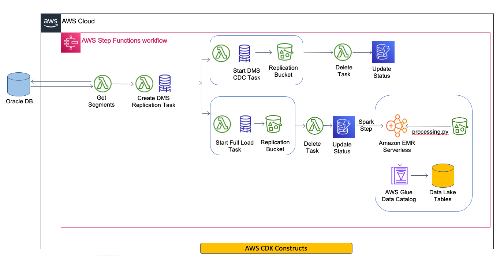

# Automating Data Migration using AWS DMS, AWS Lambdas and AWS Step Functions.

## Abstract

This pattern provides guidance on automating data migration from Oracle to the Data Lake built on Amazon S3 using AWS Data Migrtion Service, AWS Lambda, AWS Step Function and Amazon Eventbridge.
The terraform pattern in the code sets up the required infrastructure for the data migration between the source (Oracle) and destination (Amazon S3). The terraform patten is re-usable and can be extended to 
develop multiple applications. More on this pattern is discussed in the further sections.

### Architecture Diagram


Below AWS Services are deployed when the code is deployed in an AWS account:
1. An Amazon S3 bucket to hold the Oracle data
2. The AWS Lambdas to Create, Start and Delete the DMS tasks
3. A DynamoDB table to record job statistics
4. AWS Data Migration Subnet group, Replication Instance, Amazon S3 endpoint and Oracle endpoint.
5. AWS Step Function to orchestrate the job flow\
6. AWS EventBridge rule to trigger the Step Function
7. All the necessary IAM roles and policies necessary for the AWS Services to interact with each other. 

Once the infrastructure is deployed, the process to migrate data is as below:
1. An EventBridge rule is scheduled to migrate the data from an Oracle table to an Amazon S3 bucket
2. When the rule is triggered, an AWS Step function starts the migration workflow and follows the below process:
   1. AWS Lambda function creates a AWS DMS replication task and the Step Function waits on the task to get created
   2. Once the task is created, The Step Function evaluates if the task is a Full Load or a CDC job depending on the input to the STF.
   3. If Full Load, a AWS Lambda function starts the replication task and the STF monitors its progress. Upon completion, the DMS job copies the data from Oracle to the target location in Amazon S3
   4. The job statistics are captured in the DynamoDB and the STF is ended as a success.
   5. In case of a CDC job, the STF only starts the replication task, records the job statistics and ends the STF as success.


### Scenario
A company needs to migrate data from their on-premise Oracle database to the data lake on Amazon S3. They adopt an agile approach to migrate data where tables from a particular department (e.g. Sales) is migrated first and then other departments are migrated.
In addition to this, some tables are to be loaded one time each day and some are to be continuosly updated with updated data changes. To make the migration effort as smooth as possible, an automated approach to migrate data is necessary wherein the infrastructure to migrate data is set up and the customers only need to provide the schema and the table names to be migrated.
The below design proposes an automated framework which creates all the necessary infrastructure for migration and sets up all the permissions for the services to interact with each other. 

### Deployment

This project deploys the infrastructure through a CDK deployment. Make sure AWS CDK is installed on your local machine. For instructions to install AWS CDK follow the this [link](https://docs.aws.amazon.com/cdk/v2/guide/getting_started.html).

### Prerequisites

#### Clone the repository
1. Clone the repo to your local machine and open it in your favorite IDE.

#### Create the cx_Oracle AWS Lambda Layer
2. For this frameworkm we need to create a cx_Oracle package and copy it into the `dms-app\lambda_layer` folder. 
   Below are the steps:
      1. EC2 Instance.

            a. Launch an Amazon EC2 Instance with Amazon Linux 2 AMI.

            b. Connect to the Linux Instance using an SSH Client
      2. AWS CLI

            a. Install and configure the AWS CLI.
      3. Create directories "python" and "lib" folders which are required for a Python Layer
         ```
          $ mkdir ~/oracle_layer
          $ cd ~/oracle_layer
          $ mkdir python/ lib/
         ```
      4. Install the "cx_Oracle" module under "python/" directory.
         ```
         $ pip3 install cx_Oracle -t python/
         ```
      5. Download the [Oracle Instant Client](https://www.oracle.com/database/technologies/instant-client/linux-x86-64-downloads.html) (choose the version that matches the oracle instance) and unzip it to the lib/ directory
         ```
         $ wget https://download.oracle.com/otn_software/linux/instantclient/185000/instantclient-basiclite-linux.x64-18.5.0.0.0dbru.zip -O oracli.zip
         $ unzip -j oracli.zip -d lib/
         ```
      6. Copy the "libaio" library to the "lib/" folder of the layer. This library is preinstalled in Amazon Linux 2
         ```
         $ cp /lib64/libaio.so.1 lib/libaio.so.1
         ```
      7. Create a ZIP archive with "python/" and "lib/" folders.
         ```
         $ zip -r -y layer.zip python/ lib/
         ```
#### Copy the AWS Lambda Layer to code
3. Create a folder `lambda_layer` under the dms-app root directory and copy the `layer.zip` file to the `dms-app/lambda_layer` folder

### Project Build
1. Create a virtualenv on MacOS and Linux:

   ```
   $ python3 -m venv .venv
   ```

2. After the init process completes and the virtualenv is created, you can use the following
   step to activate your virtualenv.

   ```
   $ source .venv/bin/activate
   ```

3. If you are a Windows platform, you would activate the virtualenv like this:

   ```
   % .venv\Scripts\activate.bat
   ```

4. Once the virtualenv is activated, you can install the required dependencies.

   ```
   $ pip install -r requirements.txt
   ```

5. At this point you can now synthesize the CloudFormation template for this code.

   ```
   $ cdk synth
   ```

To add additional dependencies, for example other CDK libraries, just add
them to your `setup.py` file and rerun the `pip install -r requirements.txt`
command.

6. To deploy the solution

   ```
   $ cdk deploy
   ```

### Project Clean-up
6. To remove all the resources

   ```
   $ cdk destroy
   ```
## Useful commands

 * `cdk ls`          list all stacks in the app
 * `cdk synth`       emits the synthesized CloudFormation template
 * `cdk deploy`      deploy this stack to your default AWS account/region
 * `cdk diff`        compare deployed stack with current state
 * `cdk docs`        open CDK documentation
